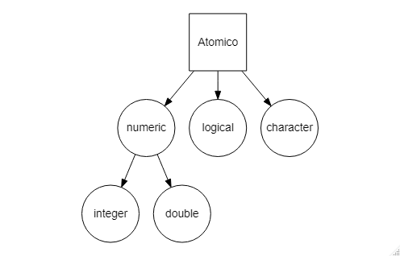

```{r setup, include=FALSE}
knitr::opts_chunk$set(echo = TRUE)
```

# Objetos

## Vectores

R tiene un espacio de trabajo conocido como el ambiente global o *global environment* donde se almacena tanto el resultado de los cálculos, como diversos objetos. Un objeto es una estructura de datos que contiene *atributos* y *métodos*, estos últimos responden a sus atributos.

El objeto más sencillo e importante en R son los *vectores*, los cuáles almacenan una cadena de información. Existen dos tipos de vectores, los *atómicos* que solo permiten información de un mismo tipo y las *listas*, que pueden incluir distintos tipos de información.
<center>

</center>
### Vectores atómicos

Son las estructuras de datos más simples en R. Se clasifican en cuatro tipos: caracteres (character) lógicos (logical) y numéricos (numeric); estos últimos a su vez pueden ser discretos (integer) y continuos (double).
<center>

</center>
Los caracteres son secuencias de letras o palabras que están entre comillas sencillas ('hola') o dobles ("hola"). Por su parte los datos lógicos representan argumentos verdaderos o falsos, ya sea abreviados (T o F) o completos (TRUE o FALSE). Los valores double se pueden expresar con decimales (3.1416), notación científica (3.12e4) o hexadecimales (0xcafe). También se pueden presentar valores infinitos (-Inf, Inf) y no numéricos (NaN, que significa **not a number**). Los valores integer son similares a los double, con la diferencia de que no presentan decimales y son seguidos de una L (1234L, 3e4 o 0xcafeL). Para generar vectores largos, se utiliza el comando de combinar/concatenar **c()**:

```{r, collapse=TRUE,prompt=TRUE}
lgl_var <- c(TRUE, FALSE)
int_var <- c(1L, 6L, 10L)
dbl_var <- c(3.141, 4.1e-3, 0xcafe)
chr_var <- c("estas leyendo", "algunos caracteres")

lgl_var
int_var
dbl_var
chr_var
```

Se puede determinar el tipo de vector y su tamaño de dos formas diferentes:

* A través de los comandos **typeof()** y **length()**

```{r, collapse=TRUE,prompt=TRUE}
typeof(lgl_var)
typeof(int_var)
typeof(dbl_var)
typeof(chr_var)

length(lgl_var)
length(int_var)
length(dbl_var)
length(chr_var)
```

* A través del comando **str()**

```{r, collapse=TRUE,prompt=TRUE}
str(lgl_var)
str(int_var)
str(dbl_var)
str(chr_var)
```


#### Dimensiones

#### Clases

### Vectores listas

#### Arreglos

#### Matrices

### Tablas y tibbles

Las características de un vector están descritas en sus **atributos**, particularmente su **dimensión** y su **clase**. La dimensión describe si el vector es un *arreglo* o una *matriz*.

## Objetos: dimensiones

## Objetos: clases

Por otro lado, las clases son la descripción del objeto (es el equivalente a los planos de una casa). El ambiente de R tiene tres sistemas de clases:

### Clase S3

Esta es la primer clase manejada por R y la más utilizada en programación. Carece de una definición predeterminada y se puede crear simplemente al añadir un atributo de clase con el comando *class()*:

```{r, collapse=TRUE,prompt=TRUE}
    #   elaboro un objeto que contiene un vector numerico
Ob3 <- list(nombre="Ramiro",edad=36,estatura=1.68)
    #   asi se despliega un objeto sin clase definida
Ob3
    #   asi se despliega la informacion de su estructura con el comando str()
str(Ob3)
    #   declaro su clase con el comando class()
class(Ob3) <- "estatura"
    #   listo, ahora tenemos un objeto de la clase "estatura"
Ob3
str(Ob3)
#c(1.65,1.61,1.72,1.84,1.55,1.63,1.67,1.68,1.68,1.65,1.64,1.71)
```

Contrario a otros lenguajes de programacaión (C++ o Python) donde hay definiciones de clase formales y los objetos tienen atributos y métodos definidos, el sistema S3 de R permite convertor la clase de un objeto de forma *ad hoc*, así como nombrar objetos que contienen distinta información con la misma clase.

### Clase S4

Esta clase de objeto tiene una estructura formalmente definida. Esto permite controlar la forma en que creamos objetos. La clase de los objetos se define con el comando *setclass()* y los objetos se crean con el comando *new()*:

```{r, collapse=TRUE,prompt=TRUE}
setClass("personal",slots = list(nombre="character",edad="numeric",estatura="numeric"))
Ob4 <- new("personal", nombre="Ramiro",edad=36,estatura=1.68)
Ob4
```

Podemos verificar si el objeto es de la clase S4 con el comando *isS4()*:

```{r, collapse=TRUE,prompt=TRUE}
isS4(Ob4)
```

### Clase referencia

Este tipo de clase es último incorporado a R respecto a las clases S3 y S4. Sus características son más similares a las clases usadas en otros lenguajes de programación orientados a objetos. El comando *setRefClass()* da como resultado una función generadora de objetos con clase de referencia:

```{r, collapse=TRUE,prompt=TRUE}
personal <- setRefClass(Class = "personal",
                        fields = list(nombre="character",edad="numeric",estatura="numeric"))
    #   Ahora personal() es una funcion generadora que puede crear objetos nuevos
```


This is an R Markdown document. Markdown is a simple formatting syntax for authoring HTML, PDF, and MS Word documents. For more details on using R Markdown see <http://rmarkdown.rstudio.com>.

When you click the **Knit** button a document will be generated that includes both content as well as the output of any embedded R code chunks within the document. You can embed an R code chunk like this:

```{r cars}
summary(cars)
```

## Including Plots

You can also embed plots, for example:

```{r pressure, echo=FALSE}
plot(pressure)
```

Note that the `echo = FALSE` parameter was added to the code chunk to prevent printing of the R code that generated the plot.
